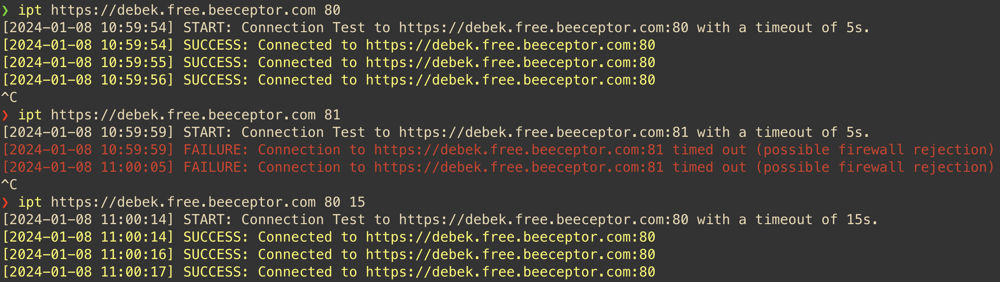

# IPT (IP Test) - Connection Tester

IPT (IP Tester) is a Go language application designed to test TCP connections to specified IP addresses and ports. It provides easy-to-interpret, color-coded output to quickly distinguish between successful and failed connections.

## Features

- TCP connection testing to a specified IP address and port.
- Customizable connection timeout setting.
- Color-coded output for clear distinction of success (green) and failure (red).

## Requirements

- Go (Golang) version 1.x (if using `go install`).
- Or, directly use the provided binary for your platform.

## Installation

### Using Precompiled Binary (Recommended)

1.  Download the latest binary for your platform from the Releases page.
2.  Place the binary in a directory included in your system's PATH (e.g., `/usr/local/bin` on macOS/Linux).

### Using `go install` (For Go Developers)

If you have Go installed and prefer to build from source:

`go install github.com/debek/ipt@latest`

This will install the `ipt` binary in your `$GOPATH/bin` directory.

## Usage

Run the program with the following arguments:

`ipt <ip_address> <port> [<timeout>]`

- `ip_address`: The IP address of the server you want to connect to.
- `port`: The server's port.
- `timeout`: Optional connection timeout (default is 5 seconds). Specify the time in a format like '5s' for 5 seconds.

## Examples

- Testing connection to a server on port 80:
- `ipt 192.168.1.1 80`

- Testing connection to a server on port 443 with a 10-second timeout:
- `ipt 192.168.1.1 443 10`

## Contributing

Contributions to this project are welcome! Please see the [CONTRIBUTE.md](https://github.com/debek/ipt/blob/main/CONTRIBUTE.md) file for guidelines on how to contribute.

## License

This project is licensed under the MIT License.
